# Common Design Pattern interview Questions:

## How would you design a scalable Python microservice handling 10k+ requests per second, and what bottlenecks would you expect first?

### Step 1 — Establish your baselines.
Before designing anything, you'd ask: 
- What does the service do **(CPU-bound? I/O-bound?)** 
- What's the payload size 
- What's the latency SLA
- What does the traffic pattern look like (**spiky vs. steady**)?

### Step 2 — The stack you'd propose:


### Runtime choice.
Python by itself won't do **10k** RPS on a single process — the GIL blocks CPU parallelism. 
The fix is to combine async/await for I/O concurrency **(FastAPI + asyncio)** with horizontal process scaling (`uvicorn` with `--workers` 4, one per CPU core). For a 4-core machine you get *~16–20k concurrent in-flight coroutines*. That's your baseline throughput unit.

### The stack layer by layer:

#### 1. **Nginx / HAProxy:** sits at the front for SSL termination, connection multiplexing, and rate limiting at the edge — before requests ever touch Python. This alone saves enormous compute.

#### 2. **FastAPI + Uvicorn** is the right Python choice here. FastAPI is async-native, has minimal overhead, and uses Starlette underneath which is one of the fastest Python ASGI frameworks. You pair it with asyncpg or SQLAlchemy 2.0 async for non-blocking DB calls.

#### 3. **Redis** as a shared cache across all workers is critical. Without it, every worker re-queries the DB for the same hot data. A read-through cache with a sensible TTL can absorb 80–90% of your read traffic before it hits the DB.

#### 4. **PgBouncer** for connection pooling. PostgreSQL can only handle `~100–200 concurrent connections before it degrades`. With 10k RPS across many workers, you'd blow that limit instantly without a pooler sitting in front.


### Where bottlenecks appear — in order of likelihood

#### 1. **Database connection exhaustion (hits first, every time)**. Each async worker maintains a connection pool. Multiply `workers × pool` size and you quickly overwhelm Postgres. 

- **Fix:** PgBouncer in transaction pooling mode + read replicas for read-heavy workloads.

#### 2. **Redis becoming a hot single point:** Under high load, Redis (single-threaded) saturates around 100k ops/sec. If every request hits Redis for session auth or rate-limit counters, you approach that limit fast. 

- **Fix:** Redis Cluster, or push simple counters to local in-process LRU caches for a "two-tier" caching strategy.

#### 3. **Python's GIL under CPU-bound spikes:** If any code path is **CPU-heavy (parsing, crypto, compression)**, it blocks the event loop. 
- **Fix:** offload to a **ProcessPoolExecutor** or push that work into a Celery task.

#### 4. **Synchronous I/O hiding in async code:** One blocking `requests.get()` inside an async handler blocks the entire event loop thread. 
- **Fix:** use `httpx` with AsyncClient, use asyncpg not `psycopg2`, audit all third-party libraries for sync calls.

#### 5. **Payload serialization overhead:** At 10k RPS, Pydantic model validation and JSON serialization add up. 
- **Fix:** `orjson` instead of `ujson` or `stdlib` json (3–5x faster), and **lazy validation** where possible.

### How to quantify this in an interview
```text
"I'd target a baseline of 2–4k RPS per worker instance on a 4-core machine. To hit 10k RPS, I'd run 3–4 instances behind a load balancer. I'd instrument p95 latency, error rate, and DB connection wait time as my primary SLOs — those are the first signals before any bottleneck becomes an outage."
```

